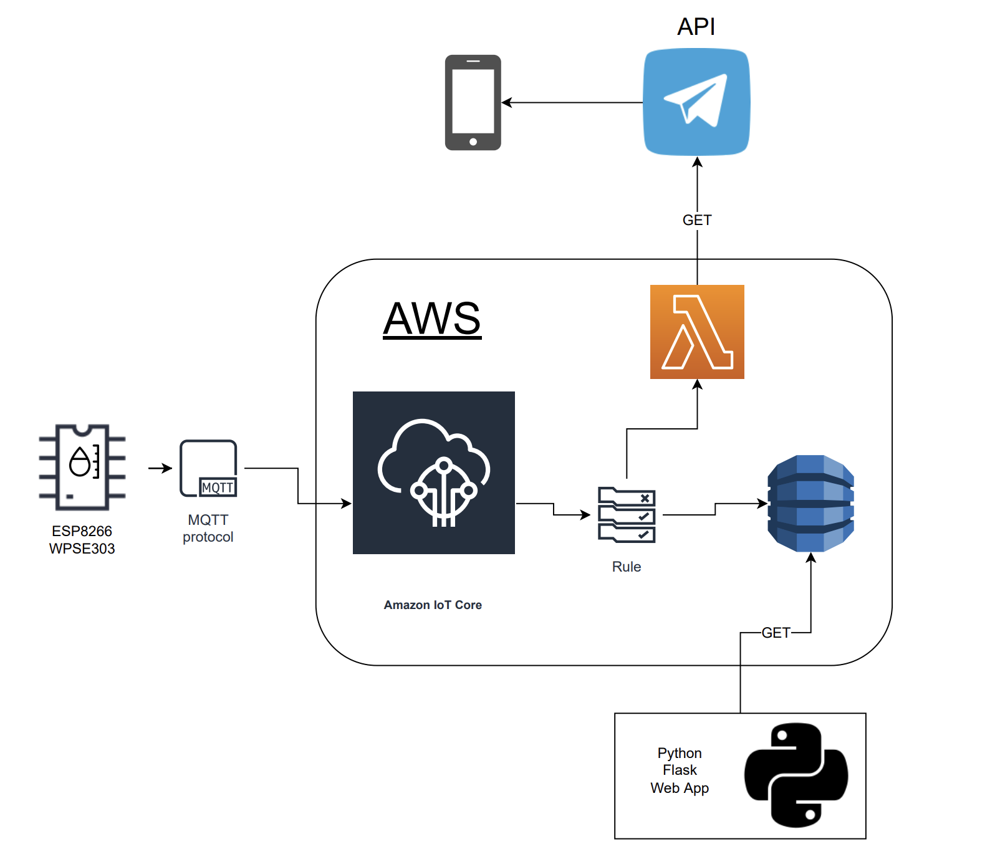
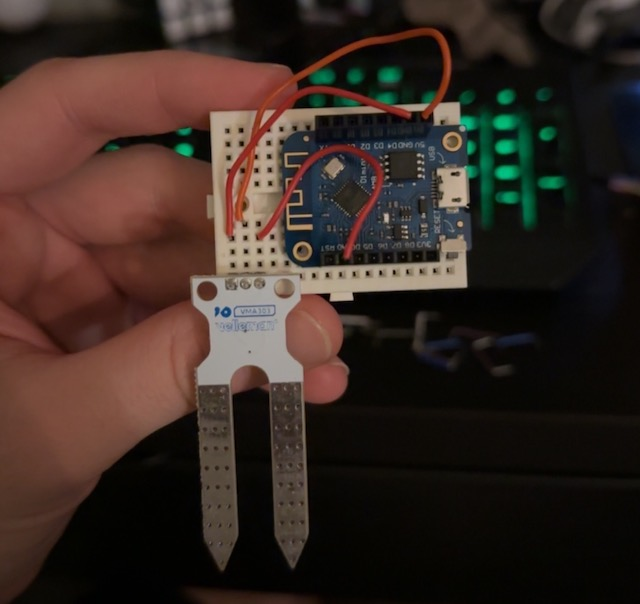
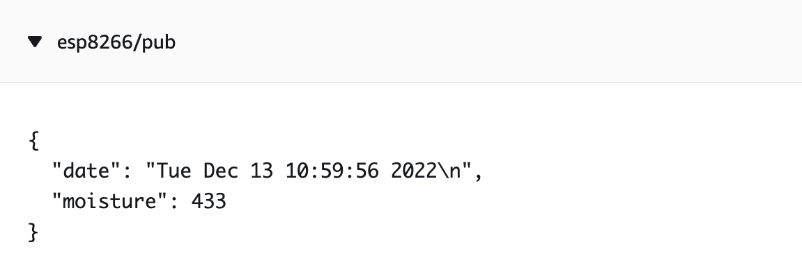
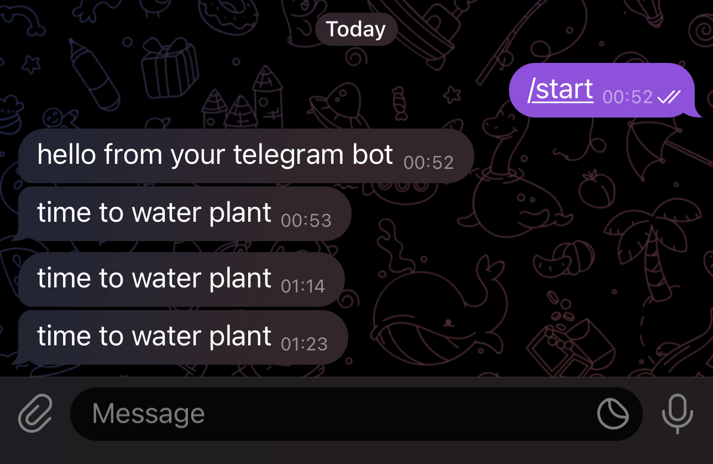
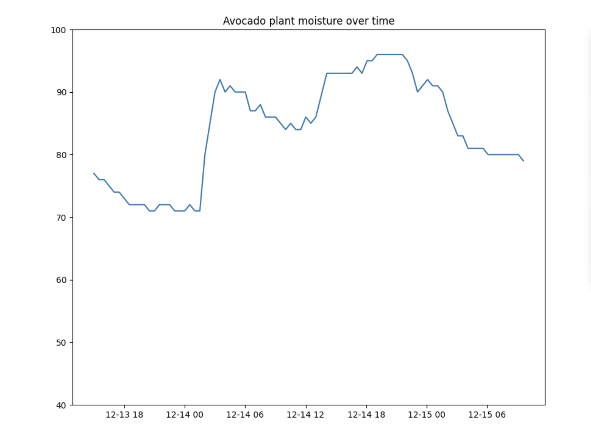

# Waterplant 🪴

## About

This is a Cloud service school project with ambition to enlarge my home automations. In this project I will use an ESP8266 with the help of a soil sensor to send MQTT messages to AWS IoT Core. I will store the data in DynamoDB and if my plant is too dry a Lambda function will trigger and send a message/notification on Telegram. I will visualize my data with Python Flask web application/server to see moisture over time 🥑. This project will also work with more devices, which is the idea, so it's scalable both up and down.



## Overview
* ### Setting up ESP8266

My first thought was to use an ESP8266-01 with a 3V, 230mAh battery (CR2032) and enable deep sleep mode which only uses ~20uA (according to ESP8266 datasheet). But I realized pretty soon that i had to solder the tiny tiny GPIO 16 on ESP8266EX chip with ESP8266-01 reset pin to use deep sleep mode. And also A0 to use analog input. (reference below)


So I bought a Wemos D1 Mini v3 instead because of good price, good size and it has A0, RST & the 16 pin so I could use the soil sensor and deep sleep to save battery. I calculated that with the CT2032 battery it would last for 59 days if ESP only sent MQTT messages 3 times a day. But the Wemos D1 Mini returns ```rst cause:5``` when waking up from deep sleep mode and after some research I found it to be either because of bad soldering or bad wiring, and I had both. So instead of batteries I use power from USB (because battery would only last like 3 hours without deep sleep) and have an internal timer that sends MQTT messages every half hour instead of three times a day. (reference below)



* ### Setting up AWS IoT

When the device was up and running I created a new device in AWS IoT Core and added certificate to authenticate connection between ESP8266 and AWS IoT. At the same time I added a new policy with MQTT topics so ESP could send messages to broker (AWS IoT). Didn't of course get it to work at first so I changed a lot in my arduino code to then realized that I only had to send a test message to the right topic with AWS IoT MQTT Test client. After that everything worked as intended and I started to receive data from my ESP8266.



* ### Setting up AWS DynamoDB

When storing my data I chose DynamoDB, which is a NoSQL database, so I could have everything inside AWS. In the future when I have more devices I will probably store old data in a S3 bucket or maybe everything and just the necessary data in DynamoDB to lower the price and overall cost.

The table in DynamoDB was pretty easy and straight forward to set up and I also found out that I could use ```${timestamp()}``` as value in Partition key so I didn't even need to send timestamp from ESP8266 anymore.


* ### Setting up AWS Lambda Function 

Now my device sends data every 30 minute to AWS IoT and stores it in the AWS Dynamo database but I want to know when I need to water my plant. So I created a Telegram bot with @BotFather and got a token to use with their API. I read that I can use ```import requests``` with python3.7 in Lambda so that was the obvious choice.
```python
import json
import requests

TELEGRAM_MSG = "time to water plant"

def lambda_handler(event, context):
    bot_request = f'https://api.telegram.org/bot{TELEGRAM_TOKEN}/sendMessage?chat_id={TELEGRAM_CHAT_ID}&text={TELEGRAM_MSG}'
    print(event)
    print(bot_request)
    response = requests.get(bot_request) 
    return {
       'statusCode': response.status_code,
       'msg': json.dumps('Message sent with success!'),
       'body': json.dumps(response.json())
   }
```
I then created a new rule in AWS IoT that triggers this Lambda function whenever my plant is to dry/needs watering and tested if everything works with AWS IoT MQTT Test Client. And it did!🤠



* ### Setting up Flask to visualize data

Lastly I configured awscli on my computer to store my AIM users ```id key``` and ```secret key``` so I could get data directly from DynamoDB with a simple python script. I then put together a flask server to visualized my data with matplotlib. (reference below)



* ### Security

In this project, and because it will only be used by me and locally at my home, I didn't look that carefully at the security. Some security measures I could have done or researched more is to hide all secrets. Mainly my AWS account ID and certificates on the ESP, I could have looked at HSM (Hardware Security Module) or TSM (Trusted Platform Module) and for AWS I could have used KMS (Key Management Service). But as I mentioned earlier, it didn't really feel that necessary to me. If I were to implement this project solution at a company or something like that, I would obviously look more into the security aspects.